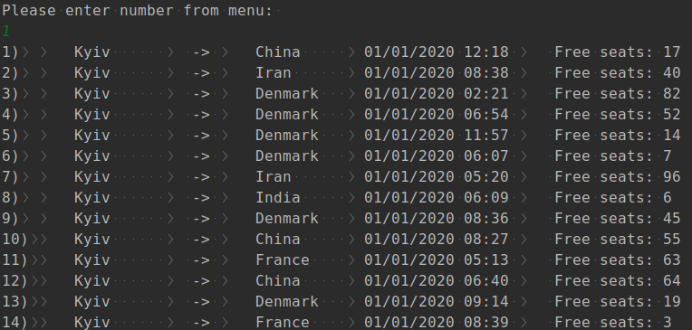
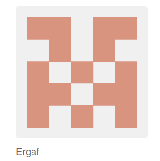

# Java core step project skills assessment

This is assessment of the java core skills of 2 students in evening group.

## Basic description of the application
In this step project we delivered console application for booking flights.
Basic authentication system was added to the application. Flights database are generated automatically 50% from Kyiv and 
50% from different countries to different countries. This approach was selected in order to be able to search for 
cross flights. After user log in and find appropriate flight it can be added to his bookings if conditions of free seats 
in the flight and time satisfy the user. Saved bookings might be canceled and viewed later. 
User can do logout and login later. 


## Technical details of the assessment
- Application has 3 layers architecture: Controller, Service, DAO.
- Database is implemented using ArrayList serialized to the binary file to the storage folder. These files are added to
_.gitignore_ so they are not presented in the repository.
- Serializer was implemented using _generics_ in order to be able to serialize different entities.
- Application has 3 main different entities: 

```java
// User
User user = new User("A", "B");
```

```java
// Flight
Flight flight = new Flight(
                FlightCreator.DEPARTURE,
                "Boyarka",
                dateGenerator.getRandomFlightLocalDateTime(),
                55 // free seats
        );
```

```java
// Booking
Booking booking = bookingService.addBooking(
                new Booking(flight, user)
        );
```
- Application logic was built around these 3 entities.
- Own exception was introduced in order to show deep understanding of how to work with exceptions in Java
```java
package ergaf.step.exceptions;

public class FlightCreationException extends RuntimeException {

    public FlightCreationException(String message) {

        super(message);
    }

}
```
- Work with console was implemented using Scanner
- Java 8 features were used in most cases in order to demonstrate how we understood it during the classes
```java
// display all bookings per user
public void displayBookings(List<Booking> bookings) {
    bookings.
            stream().
            map(Booking::getUser).
            distinct().
            collect(Collectors.toList()).forEach(user -> {
                System.out.println(user.prettyFormat());
                bookings.
                        stream().
                        filter(
                                booking -> booking.getUser().equals(user)
                        ).
                        forEach(
                                booking -> System.out.println(
                                        "\t" +
                                                booking.getId() +
                                                ") " +
                                                booking.getFlight().prettyFormat()
                                )
                        );
            });

}
```
- All critical functionality were covered by unit tests Using jUnit 4.
```java
@Test
public void get_next_id_should_return_one_when_new_user_added_to_empty_collection() {
    //given
    User user = new User("A", "B");
    userService.addUser(user);
    //when
    //then
    assertEquals(1, userService.getUserById(1).getId());
}
```
- Static logger of all actions in the DAO layer was adde in order to see how application works under the hood
```java
@Override
public ArrayList<User> getAllUsers() {
    Logger.info("был получен список users");
    return users;
}
``` 

## Technology used
- Java 8
- Junit 4

### How app does look like




## Contributors
<table>
    <tbody>
        <tr>
            <td></td>
            <td></td>
        </tr>
    </tbody>
</table>


